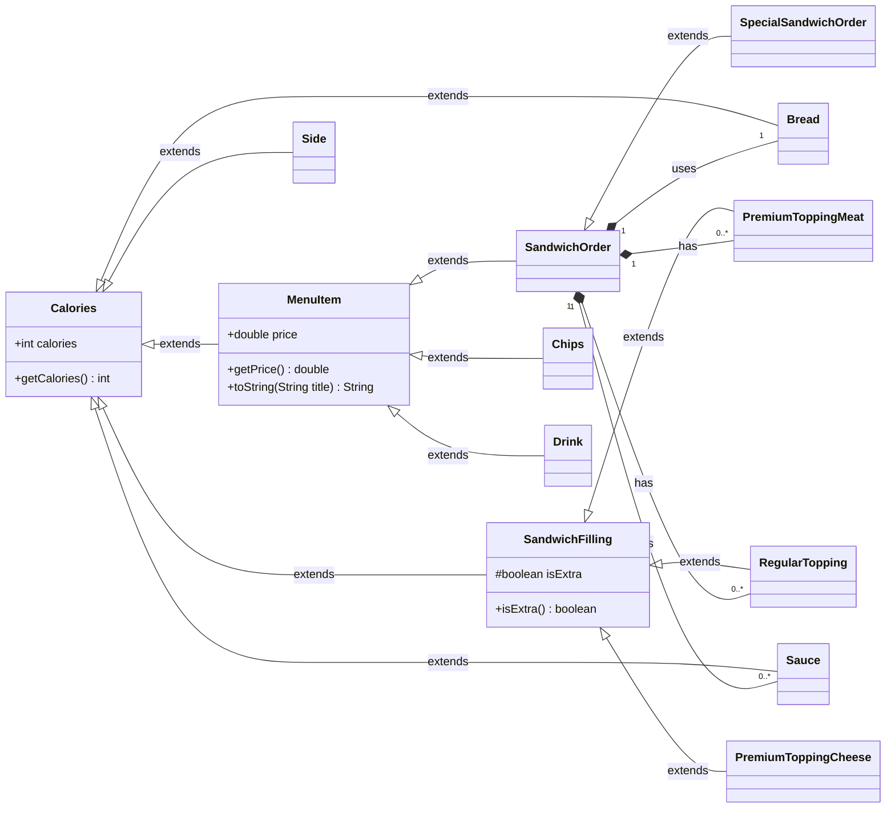

# Delicatessen Delights CLI Order System 🥪

The **Delicatessen Delights** project is a Command Line Interface (CLI) application designed to manage customer orders for a deli. It allows users to build custom sandwiches, select from specialty items, and add drinks and chips, all while dynamically tracking the total price and calorie count for their order. Upon checkout, a detailed receipt is generated and saved to a file.

-----

### Table of Contents

1.  [Key Features](#1-key-features-)
2.  [Project Structure](#2-project-structure-)
3.  [UML Diagram](#3-uml-diagram-)
4.  [Setup and Installation](#4-setup-and-installation-)
5.  [User Interface / Menu Examples](#5-user-interface--menu-examples-%EF%B8%8F)
6.  [Example Receipt Output](#6-example-receipt-output-)
7.  [Code Highlight](#7-code-highlight-)
8.  [Future Improvements](#8-future-improvements-)

-----

### 1\. Key Features ✨

  * **Customizable Sandwiches:** Users can build a sandwich from scratch, choosing size, bread, meat, cheese, toppings, sauces, and sides.
  * **Specialty Items:** Six pre-configured signature sandwiches are available for quick ordering.
  * **Order Limits:** Implements maximum quantity limits for sandwich fillings (e.g., max 2 meats, max 5 regular toppings) using a custom `FixedArrayList`.
  * **Dynamic Calculations:** Real-time calculation of total price and calorie count, with size multipliers applied to all components.
  * **Receipt Generation:** Creates a time-stamped text file receipt for the completed order.


-----

### 2\. Project Structure 📁

The project uses a standard Maven structure with packages separating core logic, food item definitions, and utility classes.

```
.
└── src/
    └── main/
        └── java/
            └── com/
                └── pluralsight/
                    ├── Main.java
                    ├── fooditems/
                    │   ├── Calories.java
                    │   ├── Chips.java
                    │   ├── Drink.java
                    │   ├── MenuItem.java
                    │   ├── enums/
                    │   │   ├── ... (Types for Bread, Meat, Cheese, etc.)
                    │   └── sandwich/
                    │       ├── Bread.java
                    │       ├── SandwichFilling.java (Abstract base for toppings)
                    │       ├── ... (Child classes for PremiumTopping, RegularTopping, etc.)
                    │       ├── SandwichOrder.java (Custom sandwich logic)
                    │       └── SpecialSandwichOrder.java (Special preset SandwichOrders)
                    └── utilizedclasses/
                        ├── CustomerOrder.java (Manages the overall order list)
                        ├── FixedArrayList.java (List with an enforced size limit)
                        ├── OrderWriter.java (Handles receipt file I/O)
                        ├── PrintColumns.java (Utility for CLI formatting)
                        ├── PrintMenu.java (Contains ASCII art and menu text)
                        └── UserInterface.java (Main CLI menu and user input logic)
```

-----

### 3\. UML Diagram 📐

This diagram illustrates the object-oriented hierarchy of the primary menu item and filling classes within the `fooditems` package.



-----

### 4\. Setup and Installation 💻

The project is built with **Maven** and requires **Java 17**.

1.  **Clone the repository:**

    ```bash
    git clone https://github.com/jason-li-codes/delicatessendelight.git
    cd DelicatessenDelights
    ```

2.  **Compile the project:**

    ```bash
    mvn clean install
    ```

3.  **Run the application:**

    ```bash
    mvn exec:java -Dexec.mainClass="com.pluralsight.Main"
    ```

-----

### 5\. User Interface & Menu Examples 🖥️

The CLI uses a custom `PrintColumns` utility to present menu options alongside relevant information (like an ASCII art logo or the current sandwich details).

#### Main Menu

The initial screen presents the main options and the deli's logo.

```
╔════════════════════════════════════════════════════════════╦══════════════════════════════════════════════════════════════════════════════════════════════════════════════════════╗
║                                                            ║ ^                                                                                                                    ║
║                                                            ║        ^!^               ^                                                                                           ║
║                                                            ║             _______________________                                                                                  ║
║                                                            ║     ^!^    |_______________________|                                                                                 ║
║                                                            ║             |.H.H.H.H.H.H.H.H.H.H.|    ^!^                                                                           ║
║                                                            ║        _____||~|~|~|~|~|~|~|~|~|~||_____   ^!^                                                                       ║
║                                                            ║       |______DELICATESSEN DELIGHTS______|                                                                            ║
║                                                            ║  _)o(_ |  HH  |.H.H.H.H.H.H.H.H.|  HH  | _)o(_                                                                       ║
║                                                            ║  /(|)\ |  HH  ||~|~|~|~|~|~|~|~||  HH  | /(|)\                                                                       ║
║                                                            ║    N   |  __  |_________________|  __  |   N                                                                         ║
║                                                            ║    N   |  HH  |.H.H.H.'`'.H.H.H.|  HH  |   N                                                                         ║
║                                                            ║    N   |  HH  ||~|~|~|!X!|~|~|~||  HH  |   N                                                                         ║
║                                                            ║  ~~^~^"|______|"""""""|~|"""""""|______|"^~^~~                                                                       ║
║                                                            ║ .|~|.:.......:.|~|.:.......:.|~|.:.......:.|~|.                                                                      ║
║                                                            ║ _| |_|_|_|_|_|_| |_|_|_|_|_|_| |_|_|_|_|_|_| |_                                                                      ║
║                                                            ║ ~| |~~~~~~~~~~~| |~~~~~~~~~~~| |~~~~~~~~~~~| |~                                                                      ║
║ Welcome to Delicatessen Delights!                          ║  | |           | |           | |           | |                                                                       ║
║ (1) Start new order                                        ║ ^~^~^^ ~^  ~ ^~^~^^   ^~ ~  ^~~^^~`  ~~^  ~^^^~                                                                      ║
║ (0) Exit                                                   ║  ~~~ ^~^~  ^~ ^^~  ~^^   ~^^    ^~^  ~^~   ~^                                                                        ║
╚════════════════════════════════════════════════════════════╩══════════════════════════════════════════════════════════════════════════════════════════════════════════════════════╝
```

#### Custom Sandwich Builder (Size Selection)

The first step in building a custom sandwich is selecting the size.

```
╔════════════════════════════════════════════════════════════╦══════════════════════════════════════════════════════════════════════════════════════════════════════════════════════╗
║                                                            ║ ╔══════════════════════════════════════════════════════╦══════════════════════════════════════════════════════╗      ║
║                                                            ║ ║                DELICATESSEN DELIGHTS:                ║       (All calorie counts are for SMALL sizes)       ║      ║
║                                                            ║ ║                    SANDWICH MENU                     ║                                                      ║      ║
║                                                            ║ ╠══════════════════════════════════════════════════════╬══════════════════════════════════════════════════════╣      ║
║                                                            ║ ║ SANDWICH SIZES                                       ║ REGULAR TOPPINGS (Free, Limit: 5)                    ║      ║
║                                                            ║ ║   Small  (4")  ............ $5.50                    ║   - Lettuce (5)           |   - Peppers (7)          ║      ║
║                                                            ║ ║   Medium (8")  ............ $7.00                    ║   - Tomato (10)           |   - Jalapeños (5)        ║      ║
║                                                            ║ ║   Large  (12") ............ $8.50                    ║   - Onion (8)             |   - Pickles (5)          ║      ║
║                                                            ║ ╠══════════════════════════════════════════════════════╣   - Olives (15)           |   - Spinach (10)         ║      ║
║                                                            ║ ║ BREAD OPTIONS (Choose 1)                             ║   - Mushrooms (12)                                   ║      ║
║                                                            ║ ║   - White (70 cal)           |   - Wheat (80 cal)    ╠══════════════════════════════════════════════════════╣      ║
║                                                            ║ ║   - Multigrain (90 cal)      |   - Rye (85 cal)      ║ SAUCES (Free, Limit: 3)                              ║      ║
║                                                            ║ ╠══════════════════════════════════════════════════════╣   - Mayo (50)             |   - Ranch (120)          ║      ║
║                                                            ║ ║ PREMIUM MEATS (Limit: 2 meats)                       ║   - Mustard (10)          |   - Caesar (130)         ║      ║
║                                                            ║ ║   Small:  $1.00  | Extra: $0.50                      ║   - Guacamole (150)       |   - Pesto (200)          ║      ║
║                                                            ║ ║   Medium: $2.00  | Extra: $1.00                      ╠══════════════════════════════════════════════════════╣      ║
║                                                            ║ ║   Large:  $3.00  | Extra: $1.50                      ║ SIDES (Free, Limit: 2)                               ║      ║
║                                                            ║ ║   - Turkey (120 cal)     |   - Roast Beef (200 cal)  ║   - Fries (375 cal)       |   - Pickles (10 cal)     ║      ║
║                                                            ║ ║   - Ham (100 cal)        |   - Pastrami (250 cal)    ╠══════════════════════════════════════════════════════╣      ║
║                                                            ║ ║   - Chicken (150 cal)    |   - Bacon (300 cal)       ║ SPECIALS ($10.00)                                    ║      ║
║                                                            ║ ╠══════════════════════════════════════════════════════╣   - Green Mountain Melt (1030 cal)                   ║      ║
║                                                            ║ ║ PREMIUM CHEESES (Limit: 2 cheeses)                   ║   - Smokehouse Stack (2200 cal)                      ║      ║
║                                                            ║ ║   Small:  $0.75  | Extra: $0.30                      ║   - Southwest Sunrise (970 cal)                      ║      ║
║                                                            ║ ║   Medium: $1.50  | Extra: $0.60                      ║   - Pastrami King (1886 cal)                         ║      ║
║ What kind of sandwich would you like?                      ║ ║   Large:  $2.25  | Extra: $0.90                      ║   - Garden Delight (874 cal)                         ║      ║
║ (S) Specials                                               ║ ║   - American (75 cal)      |   - Cheddar (110 cal)   ║   - Mediterranean Delight (714 cal)                  ║      ║
║ (C) Custom                                                 ║ ║   - Swiss (100 cal)        |   - Provolone (90 cal)  ║                                                      ║      ║
║ (X) Return to previous menu                                ║ ╚══════════════════════════════════════════════════════╩══════════════════════════════════════════════════════╝      ║
╚════════════════════════════════════════════════════════════╩══════════════════════════════════════════════════════════════════════════════════════════════════════════════════════╝

```

#### Topping Selector (Meat)

A three-column layout is used during the topping selection process, allowing the user to view the menu, select an option, and review their current sandwich simultaneously.

```
╔══════════════════════════════════════════════════════════════════════════════════════════════════════════════════════════════════════════════════════════════════════════════╦════════════════════════════════════════════════════════════╗
║                                                            ║ ╔══════════════════════════════════════════════════════╦══════════════════════════════════════════════════════╗ ║                                                            ║
║                                                            ║ ║                DELICATESSEN DELIGHTS:                ║       (All calorie counts are for SMALL sizes)       ║ ║                                                            ║
║                                                            ║ ║                    SANDWICH MENU                     ║                                                      ║ ║                                                            ║
║                                                            ║ ╠══════════════════════════════════════════════════════╬══════════════════════════════════════════════════════╣ ║                                                            ║
║                                                            ║ ║ SANDWICH SIZES                                       ║ REGULAR TOPPINGS (Free, Limit: 5)                    ║ ║                                                            ║
║                                                            ║ ║   Small  (4")  ............ $5.50                    ║   - Lettuce (5)           |   - Peppers (7)          ║ ║ Current sandwich:                                          ║
║                                                            ║ ║   Medium (8")  ............ $7.00                    ║   - Tomato (10)           |   - Jalapeños (5)        ║ ║ =====================================                      ║
║                                                            ║ ║   Large  (12") ............ $8.50                    ║   - Onion (8)             |   - Pickles (5)          ║ ║ Size: MEDIUM                                               ║
║                                                            ║ ╠══════════════════════════════════════════════════════╣   - Olives (15)           |   - Spinach (10)         ║ ║ Bread: MULTIGRAIN                                          ║
║                                                            ║ ║ BREAD OPTIONS (Choose 1)                             ║   - Mushrooms (12)                                   ║ ║ Toasted: Yes                                               ║
║                                                            ║ ║   - White (70 cal)           |   - Wheat (80 cal)    ╠══════════════════════════════════════════════════════╣ ║ Meats:                                                     ║
║                                                            ║ ║   - Multigrain (90 cal)      |   - Rye (85 cal)      ║ SAUCES (Free, Limit: 3)                              ║ ║  - TURKEY (Extra)                                          ║
║                                                            ║ ╠══════════════════════════════════════════════════════╣   - Mayo (50)             |   - Ranch (120)          ║ ║ Cheeses:                                                   ║
║                                                            ║ ║ PREMIUM MEATS (Limit: 2 meats)                       ║   - Mustard (10)          |   - Caesar (130)         ║ ║  - SWISS (Regular)                                         ║
║                                                            ║ ║   Small:  $1.00  | Extra: $0.50                      ║   - Guacamole (150)       |   - Pesto (200)          ║ ║  - PROVOLONE (Regular)                                     ║
║                                                            ║ ║   Medium: $2.00  | Extra: $1.00                      ╠══════════════════════════════════════════════════════╣ ║ Toppings:                                                  ║
║                                                            ║ ║   Large:  $3.00  | Extra: $1.50                      ║ SIDES (Free, Limit: 2)                               ║ ║  - LETTUCE (Regular)                                       ║
║                                                            ║ ║   - Turkey (120 cal)     |   - Roast Beef (200 cal)  ║   - Fries (375 cal)       |   - Pickles (10 cal)     ║ ║  - TOMATO (Regular)                                        ║
║                                                            ║ ║   - Ham (100 cal)        |   - Pastrami (250 cal)    ╠══════════════════════════════════════════════════════╣ ║  - ONION (Regular)                                         ║
║                                                            ║ ║   - Chicken (150 cal)    |   - Bacon (300 cal)       ║ SPECIALS ($10.00)                                    ║ ║ Sauces:                                                    ║
║                                                            ║ ╠══════════════════════════════════════════════════════╣   - Green Mountain Melt (1030 cal)                   ║ ║  - GUACAMOLE                                               ║
║                                                            ║ ║ PREMIUM CHEESES (Limit: 2 cheeses)                   ║   - Smokehouse Stack (2200 cal)                      ║ ║  - PESTO                                                   ║
║                                                            ║ ║   Small:  $0.75  | Extra: $0.30                      ║   - Southwest Sunrise (970 cal)                      ║ ║ Sides:                                                     ║
║                                                            ║ ║   Medium: $1.50  | Extra: $0.60                      ║   - Pastrami King (1886 cal)                         ║ ║   - FRIES                                                  ║
║                                                            ║ ║   Large:  $2.25  | Extra: $0.90                      ║   - Garden Delight (874 cal)                         ║ ║ =====================================                      ║
║ Would you like to add another side?                        ║ ║   - American (75 cal)      |   - Cheddar (110 cal)   ║   - Mediterranean Delight (714 cal)                  ║ ║ Price: $13.00                                              ║
║ (Y) Yes                                                    ║ ║   - Swiss (100 cal)        |   - Provolone (90 cal)  ║                                                      ║ ║ Calories: 2296                                             ║
║ (N) No                                                     ║ ╚══════════════════════════════════════════════════════╩══════════════════════════════════════════════════════╝ ║ =====================================                      ║
╚══════════════════════════════════════════════════════════════════════════════════════════════════════════════════════════════════════════════════════════════════════════════╩════════════════════════════════════════════════════════════╝
```

#### Order Summary

The checkout screen displays the current order list and totals before processing.

```
╔════════════════════════════════════════════════════════════╦══════════════════════════════════════════════════════════════════════════════════════════════════════════════════════╗
║                                                            ║ 1. Green Mountain Melt                                                                                               ║
║                                                            ║ =====================================                                                                                ║
║                                                            ║ Size: MEDIUM                                                                                                         ║
║                                                            ║ Bread: MULTIGRAIN                                                                                                    ║
║                                                            ║ Toasted: Yes                                                                                                         ║
║                                                            ║ Meats:                                                                                                               ║
║                                                            ║  - TURKEY (Extra)                                                                                                    ║
║                                                            ║ Cheeses:                                                                                                             ║
║                                                            ║  - AMERICAN (Extra)                                                                                                  ║
║                                                            ║ Toppings:                                                                                                            ║
║                                                            ║  - LETTUCE (Regular)                                                                                                 ║
║                                                            ║  - TOMATO (Regular)                                                                                                  ║
║                                                            ║  - SPINACH (Regular)                                                                                                 ║
║                                                            ║ Sauces:                                                                                                              ║
║                                                            ║  - PESTO                                                                                                             ║
║                                                            ║ Sides:                                                                                                               ║
║                                                            ║   - PICKLES                                                                                                          ║
║                                                            ║ =====================================                                                                                ║
║                                                            ║ Price: $10.00                                                                                                        ║
║                                                            ║ Calories: 1062                                                                                                       ║
║                                                            ║ =====================================                                                                                ║
║                                                            ║                                                                                                                      ║
║                                                            ║ 2. DRINK                                                                                                             ║
║                                                            ║ =====================================                                                                                ║
║                                                            ║ Size: MEDIUM                                                                                                         ║
║                                                            ║ Brand: SPRY-TUH                                                                                                      ║
║                                                            ║ =====================================                                                                                ║
║                                                            ║ Price: $2.50                                                                                                         ║
║                                                            ║ Calories: 180                                                                                                        ║
║                                                            ║ =====================================                                                                                ║
║ Would you like to checkout?                                ║                                                                                                                      ║
║ (1) Yes, checkout                                          ║ -------------------------------------                                                                                ║
║ (2) No, I want to remove an item                           ║ Total Price: 12.50                                                                                                   ║
║ (3) Return to previous menu                                ║ Total Calories: 1242                                                                                                 ║
╚════════════════════════════════════════════════════════════╩══════════════════════════════════════════════════════════════════════════════════════════════════════════════════════╝
```

-----

### 6\. Example Receipt Output 🧾

The final receipt is saved to the `receipts/` directory and follows this format (using the example order above):

```text
2025-11-14T06:30:00.123456
-------------------------------------
1. SMOKEHOUSE STACK
=====================================
Size: MEDIUM
Bread: RYE
Toasted: Yes
Meats:
 - ROAST BEEF (Extra)
 - BACON (Extra)
Cheeses:
 - CHEDDAR (Extra)
Toppings:
 - ONION (Regular)
 - PEPPERS (Regular)
 - PICKLES (Regular)
Sauces:
 - MUSTARD
Sides:
  - FRIES
=====================================
Price: $10.00
Calories: 2200
=====================================

2. DRINK
=====================================
Size: LARGE
Brand: KO-KUH
=====================================
Price: $3.00
Calories: 300
=====================================

3. CHIPS
=====================================
Brand: PO-TAY-TOHZ
=====================================
Price: $1.50
Calories: 150
=====================================
-------------------------------------
Total Price: $14.50
Total Calories: 2650
-------------------------------------
Thank you for coming to
Delicatessen Delights,
please come again!
```

-----

### 7\. Code Highlight 💡

This method showcases the **dynamic calorie calculation**, which ensures the total calorie count is always accurate regardless of the sandwich's components or size. It uses Java Streams to efficiently aggregate the calories of every component and applies a final multiplier based on the sandwich size (`SMALL`=x1, `MEDIUM`=x2, `LARGE`=x3).

```java
// Snippet from SandwichOrder.java
// Update calories of SandwichOrder by going through all attributes individually
public void updateCalories() {

    // Begin with integer of value 0
    int totalCal = 0;
    totalCal += bread.getCalories(); // Extract calories from bread
    totalCal += premiumToppingMeats.getItems().stream()
            .mapToInt(PremiumToppingMeat::getCalories) // Extract calories from each meat topping
            .sum() +
            premiumToppingMeats.getItems().stream()
                    .filter(PremiumToppingMeat::isExtra)  // Filter the items where isExtra is true
                    .mapToInt(PremiumToppingMeat::getCalories) // Get calories only for those extra
                    .sum();
    totalCal += premiumToppingCheeses.getItems().stream()
            .mapToInt(PremiumToppingCheese::getCalories) // Extract calories from each cheese topping
            .sum() +
            premiumToppingCheeses.getItems().stream()
                   .filter(PremiumToppingCheese::isExtra)  // Filter the items where isExtra is true
                   .mapToInt(PremiumToppingCheese::getCalories) // Get calories only for those extra
                   .sum();
    totalCal += regularToppings.getItems().stream()
            .mapToInt(RegularTopping::getCalories) // Extract calories from each regular topping
            .sum() +
            regularToppings.getItems().stream()
                   .filter(RegularTopping::isExtra)  // Filter the items where isExtra is true
                   .mapToInt(RegularTopping::getCalories) // Get calories only for those extra
                   .sum();
    totalCal += sauces.getItems().stream()
            .mapToInt(Sauce::getCalories) // Extract calories from each sauce
            .sum();
    totalCal += sides.getItems().stream()
            .mapToInt(Side::getCalories) // Extract calories from each side
            .sum();

    // Use multiplier depending on SandwichOrder size
    this.calories = totalCal * switch (size) {
        case SMALL -> 1;
        case MEDIUM -> 2;
        case LARGE -> 3;
    };
}
```

-----

### 8\. Future Improvements 🚀

  * **Dessert Menu:** Implement a new `MenuItem` subclass for desserts or pastries to expand the menu beyond sandwiches.
  * **Order Modification:** Enhance the checkout menu to allow the user to modify individual items (e.g., change the size of a drink or add a topping to a custom sandwich) instead of only removal.
  * **Dynamic Column Sizing:** Refactor `PrintColumns.java` to dynamically calculate console width for more robust formatting across different terminals, replacing the current hardcoded width.
  * **External Menu Data:** Move all menu prices, calorie counts, and constraints from Java code into an external data source (like a JSON file or database) for easier menu updates without recompiling.
